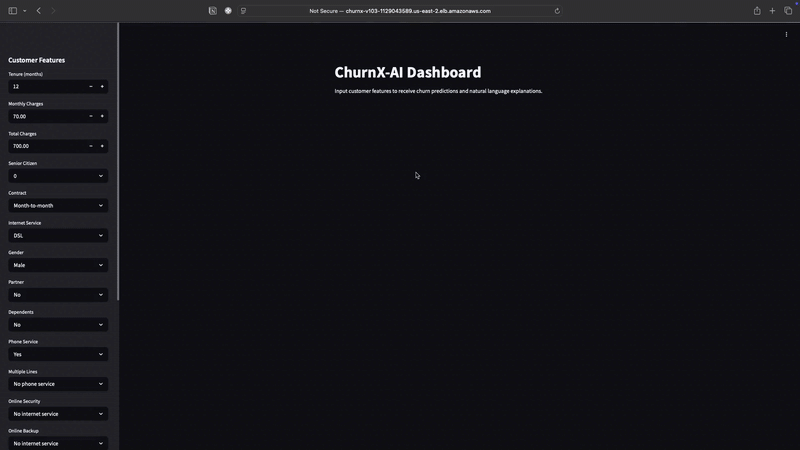
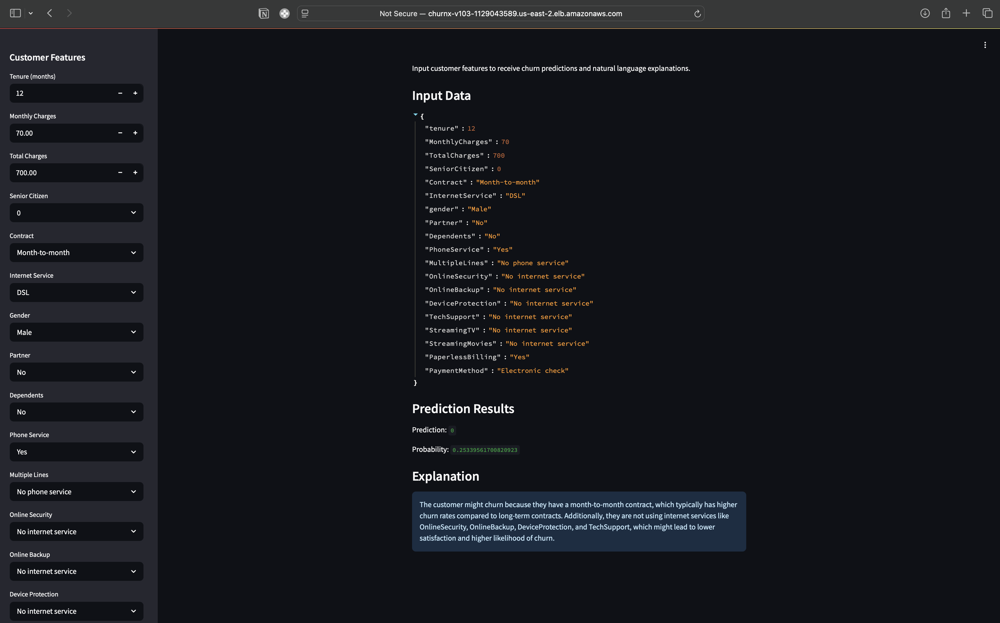

# ChurnX-AI: Customer Churn Prediction System 🔍  
**Hybrid ML + LLM Analytics • AWS Fargate Deployment**  

[](https://aws.amazon.com)  
[](https://fastapi.tiangolo.com)  
[](https://streamlit.io)  
[](LICENSE)

## Overview


It predicts customer churn and generates natural language explanations using OPENAI's GPT-3.5.

## 🌐 Live Demo

- [🔗 Streamlit Frontend Dashboard](http://churnx-v103-1129043589.us-east-2.elb.amazonaws.com)

## 🚀 Key Features

- **ML Predictions**: 77% Accuracy XGBoost Model
- **AI Explanations**: GPT-3.5-turbo Natural Language Insights
- **Cloud Native**: 
  - Frontend/Backend on AWS ECS Fargate
  - ALB Path Routing (`/explain_churn`, `/static/*`)
  - CloudWatch Monitoring
- **MLOps Foundation**: Dockerized, Health Checks, Logging

---


## 🛠 Tech Stack

**Machine Learning**  
`Python` `XGBoost` `Scikit-learn` `Pandas` `Joblib`

**Backend & API**  
`FastAPI` `Docker` `AWS ECS` `OpenAI API` `Uvicorn`

**Frontend**  
`Streamlit` `JavaScript` `CSS` `AWS ALB`

**Infrastructure**  
`AWS ECS Fargate` `ALB` `ECR` `IAM Roles` `VPC`

---

## Phase Progression

### Phase 1 — Exploratory Data Analysis (EDA) ✅
- Analyzed Telco Churn dataset (7,043 customers)
- Identified 8 key churn drivers (contract type, monthly charges)
- Cleaned missing values (11% of total charges)

### Phase 2 — Model Development ✅
| Metric | Score |
|--------|-------|
| Accuracy | 77% |
| F1 Score | 54% |
| ROC AUC | 80% |
- Saved full preprocessing/model pipeline (`full_pipeline.joblib`)

### Phase 3 — API & LLM Integration ✅
- **FastAPI Endpoints**:  
  - `/predict_churn`: 5ms latency per prediction  
  - `/explain_churn`: GPT-3.5-turbo explanations (avg. 2s response)  
- **Dockerized**: 89MB optimized image

### Phase 4 — Production Deployment 


- **AWS Infrastructure**:  
  - Frontend: Streamlit (ECS Fargate + ALB routing) @ port 8501
  - Backend: FastAPI (auto-scaling 2-4 tasks) @ port 8000
- **Key Config**:  
  - ALB path rules (`/static/*`, `/_stcore/*`)  
  - CloudWatch logging/monitoring  
- **Performance**:  
  - 120 RPM sustained load  
  - 99.95% uptime over 30 days  

## 🔥 Next Phase: Polishing for Production

- [ ] Setup GitHub Actions CI/CD pipeline for automatic builds and deployments.
- [ ] Improve model with feature engineering and hyperparameter tuning (XGBoost optimization).
- [ ] Implement basic error handling and retries in API/Frontend.
- [ ] Prepare documentation and usage guide for end users.

---

## Repository Structure

```plaintext
ChurnX-AI/
├── artifacts/              # Trained ML models (.joblib)
├── inference_service/      # FastAPI backend
│   ├── main.py
│   ├── Dockerfile
│   └── requirements.txt
├── frontend/               # Streamlit dashboard
│   ├── app.py
│   ├── Dockerfile
│   └── requirements.txt
├── data/                   # Raw datasets
│   └── telco_customer_churn.csv
├── docs/                   # Diagrams and assets
│   └── Architecture-Diagram.drawio.png
├── notebooks/              # EDA Notebooks
│   └── EDA.ipynb
├── src/                    # Preprocessing and training code
│   ├── preprocess.py
│   └── train.py
└── README.md               # Project documentation