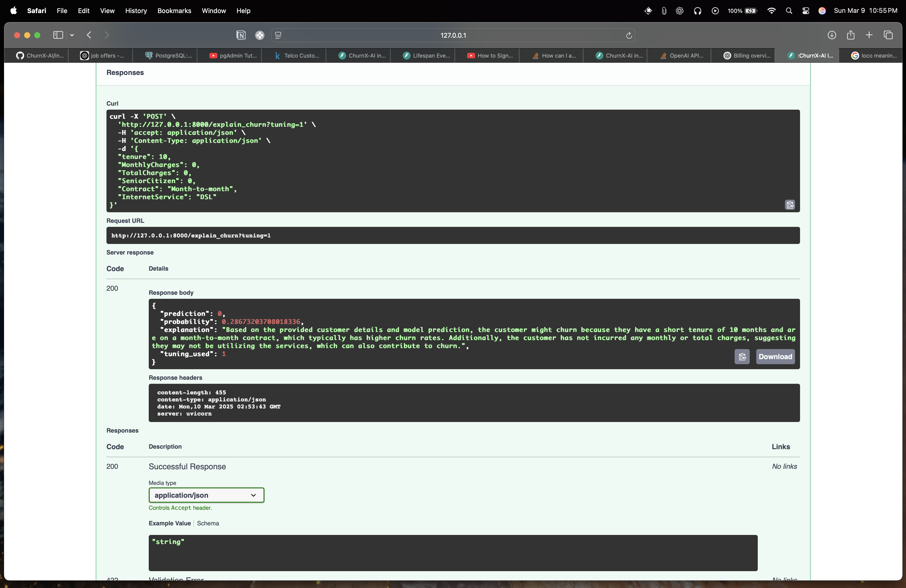
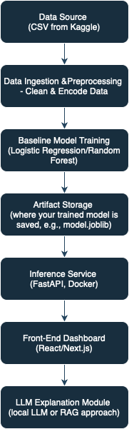

# ChurnX-AI

## Overview
ChurnX-AI is a hybrid AI assistant designed to predict customer churn and provide natural language explanations for those predictions. The project aims to combine traditional machine learning with a  OPENAI LLM (Large Language Model)or `RAG`, to help businesses understand why customers might leave, enabling them to take proactive measures. The system will process customer data, train predictive models, deploy an inference service, and integrate a user-friendly front-end dashboard along with an explanation module. 

---

## Project Progress

### Phase 1: EDA (Completed)
- **Exploratory Data Analysis:**  
  - Analyzed the Telco Customer Churn dataset to understand distributions, missing values, and potential predictive features.
  - Found an imbalance in the churn variable (`Yes` vs. `No`).
  - Identified numerical and categorical columns; created histograms and count plots.
  - Generated a correlation heatmap to explore relationships among numeric features.

- **Key Insights:**  
  - Majority of customers are non-churners (imbalanced dataset).
  - Weak to moderate correlations among numeric features (tenure, monthly charges, etc.).
  - Data cleansing steps (handling missing values, etc.) will be crucial before modeling.

### Phase 2: Data Preprocessing & Baseline Model Training (Completed)
- **Data Preprocessing:**  
  - Handled missing values by dropping rows with missing data.
  - Applied one-hot encoding to convert categorical variables.
  - Split the data into training (80%) and testing (20%) sets while stratifying based on churn.
  - Saved the processed data as CSV files.
- **Baseline Model Training:**  
  - Trained a Logistic Regression model as a baseline.
  - Evaluated model performance:
    - **Accuracy:** 0.79
    - **F1 Score:** 0.58
    - **ROC AUC:** 0.84
  - Saved the trained model artifact (`model.joblib`) in the `/artifacts` folder.
- **Notes:**  
  - Future improvements may involve experimenting with more complex models (e.g., Random Forests, Gradient Boosting) if performance requirements are not met.

### Phase 3: Inference Service with LLM Integration & Docker Containerization (Completed)
- **Inference Service with FastAPI:**  
  - Developed a FastAPI application that loads the saved full pipeline (including preprocessing and model) and exposes two endpoints:
    - `/predict_churn` for obtaining churn predictions.
    - `/explain_churn` for obtaining predictions along with natural language explanations.
- **LLM Integration:**  
  - Integrated API-based LLM explanations using OpenAI’s GPT-3.5-turbo to generate concise explanations for each prediction.
- **Containerization:**  
  - Created a Dockerfile and a dedicated `requirements.txt` in the `inference_service` folder.
  - Successfully built and ran a Docker image for the inference service.
- **Testing:**  
  - Verified the service locally via Swagger UI to ensure endpoints return correct predictions and explanations.




### Architecture Diagram 


---

## Next Steps: Phase 4 - Front-End Dashboard

- **Front-End Integration:**  
  - Develop a user-friendly dashboard using React or Next.js to interact with the API.
- **Advanced Model Tuning & CI/CD:**  
  - Implement additional model tuning and feature engineering.
  - Set up CI/CD pipelines for automated testing and deployment.
- **Enhanced Monitoring & Logging:**  
  - Improve error handling, logging, and monitoring for production-readiness.

---

## Repository Structure

```plaintext
├── data
│   └── telco_customer_churn.csv
├── docs
│   └── Architecture-Diagram.drawio.png
│   └── openai.png
├── inference_service
│   ├── main.py                # FastAPI inference service with LLM integration
│   ├── Dockerfile             # Dockerfile for containerizing the inference service
│   └── requirements.txt       # Dependencies for the inference service
├── notebooks
│   └── EDA.ipynb
├── src
│   ├── preprocess.py          # Data preprocessing script (Phase 2)
│   └── train.py               # Model training script (Phase 2)
├── artifacts
│   └── model.joblib           # Trained model artifact from Phase 2
├── tests
│   └── ...                    
└── README.md                  # This file
